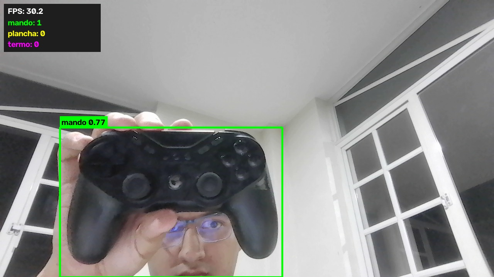
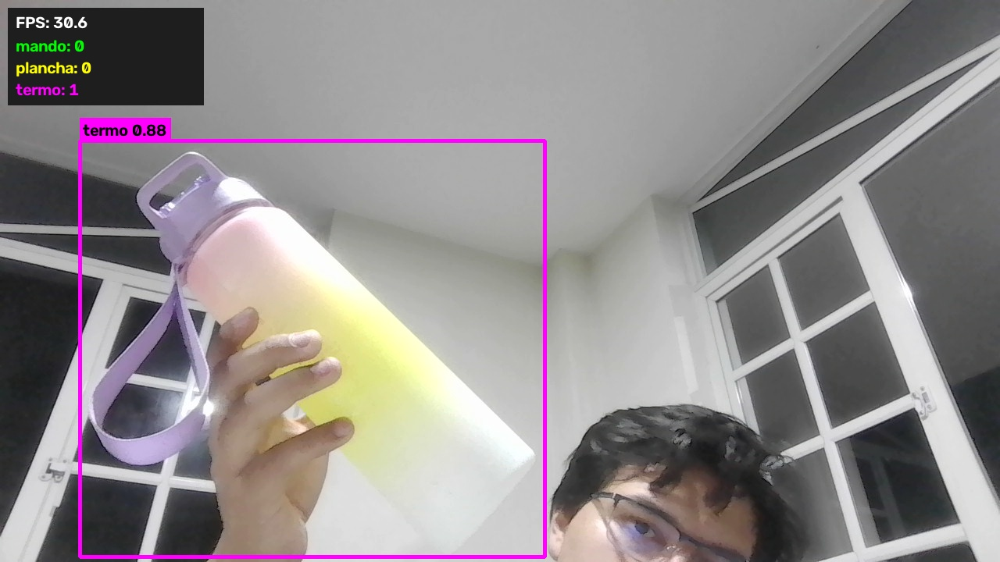
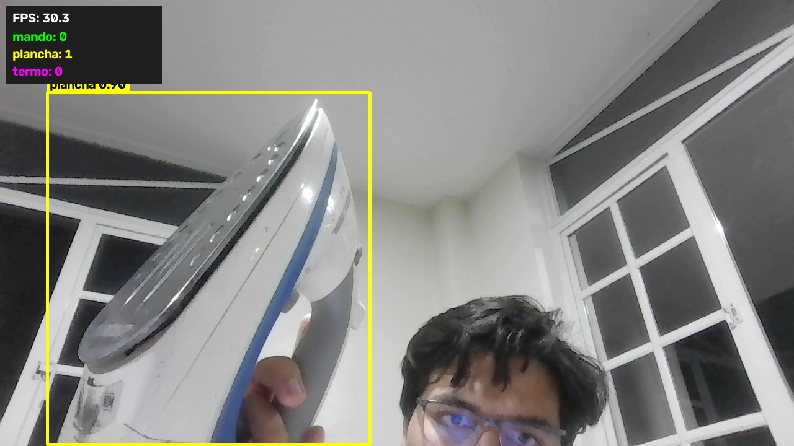
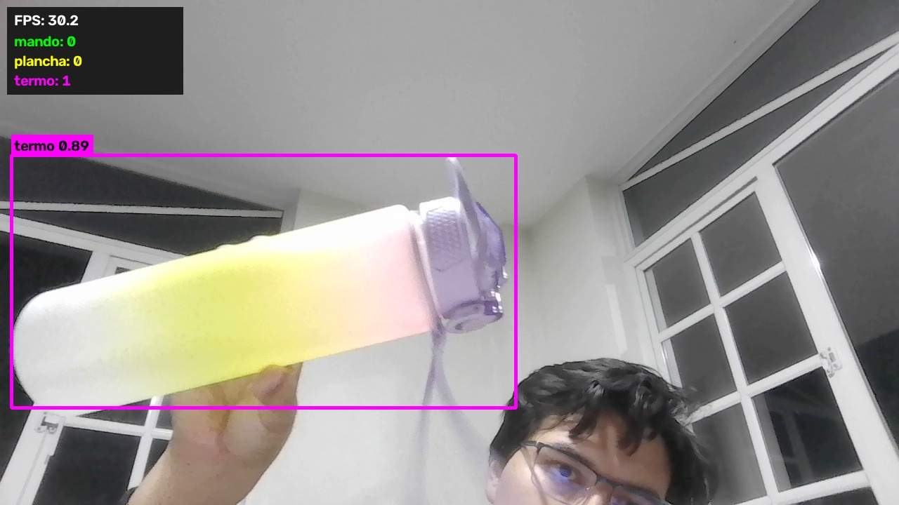
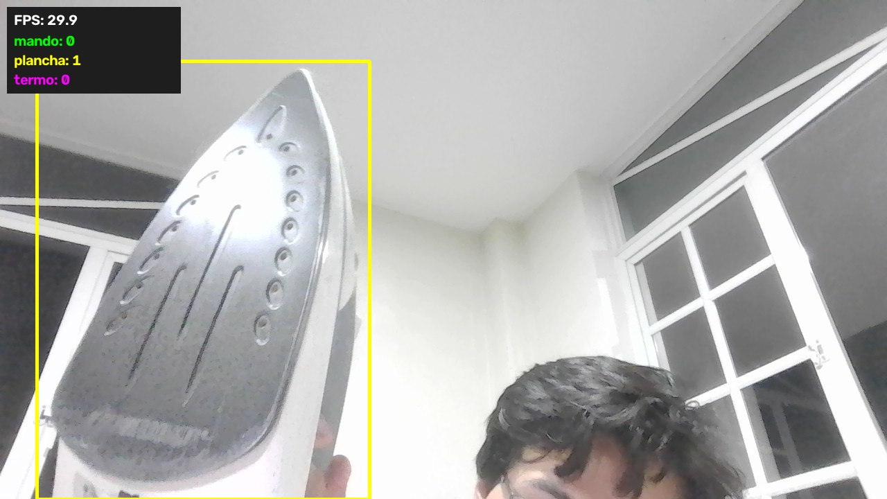
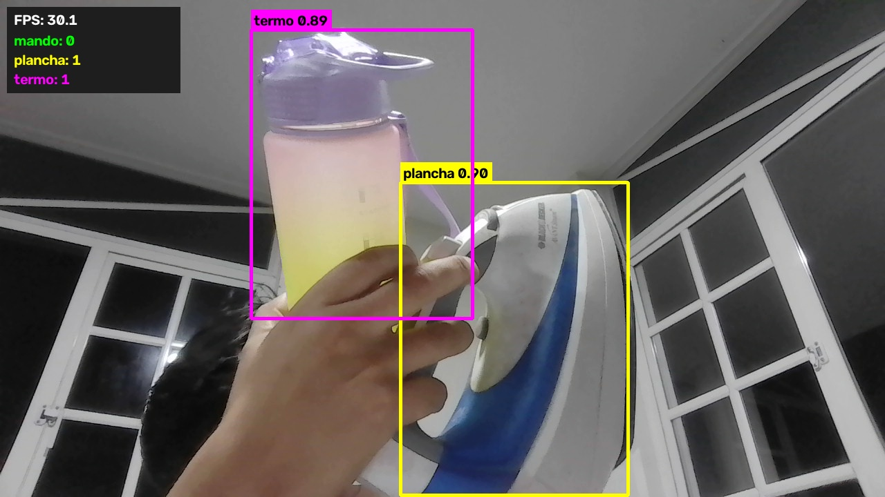
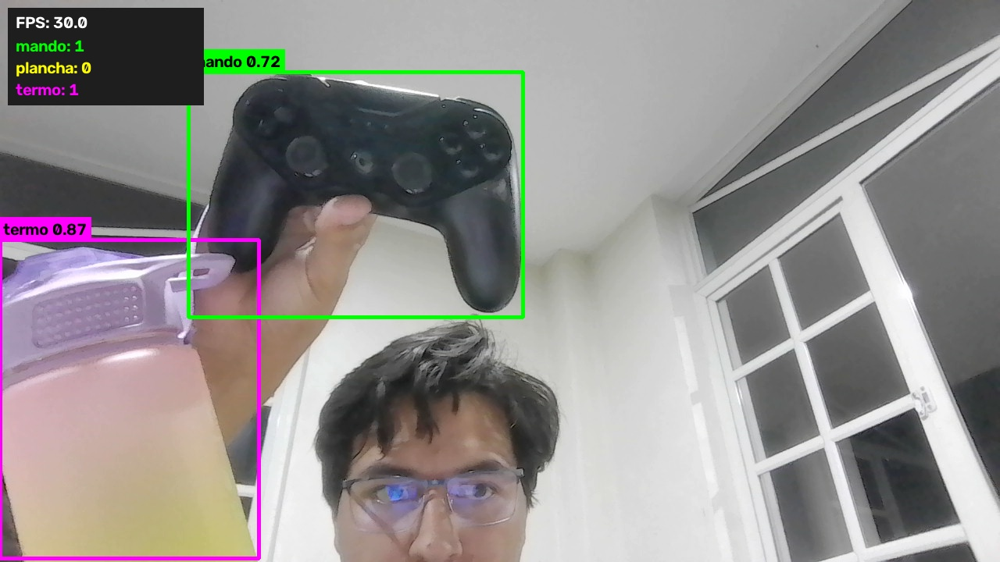
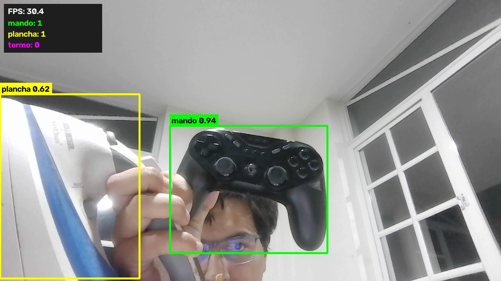

# Detector personalizado de objetos con YOLO26 y Roboflow

Detector de objetos entrenado con un dataset propio. Reconoce tres objetos cotidianos que el modelo preentrenado no conoce, y funciona en tiempo real con la webcam.

| Clase | Objeto |
|---|---|
| `termo` | Botella de agua morada con degradado rosa, amarillo y blanco |
| `mando` | Control de videojuegos negro |
| `plancha` | Plancha de ropa blanca y azul |

Se parte de **YOLO26 nano** preentrenado en COCO y se ajusta (*fine-tuning*) con las fotos propias, anotadas en **Roboflow**.

## Cómo funciona

1. **Captura.** Se graba un video de cada objeto con el celular y `src/extract_frames.py` extrae los cuadros útiles: descarta los borrosos y los que se parecen demasiado entre sí, y se queda con los más variados.
2. **Anotación.** Las fotos se suben a Roboflow, se anotan con cajas (*bounding boxes*) y se genera una versión del dataset con sus conjuntos de entrenamiento, validación y prueba.
3. **Entrenamiento.** El notebook descarga el dataset con la API de Roboflow y entrena YOLO26 durante 50 épocas, con parada anticipada si el modelo deja de mejorar.
4. **Evaluación.** Se mide el modelo sobre imágenes que no usó para entrenar con precisión, recall, mAP50 y mAP50-95, por clase y en global, y se generan la matriz de confusión y la curva precisión-recall.
5. **Detección en tiempo real.** `src/detect_webcam.py` abre la webcam y dibuja en cada cuadro las cajas con su clase y confianza, un contador por clase y los cuadros por segundo.

## Dataset

Las fotos originales están en `data/fotos/`, una carpeta por tipo:

| Carpeta | Fotos | Contenido |
|---|---|---|
| `termo` | 29 | El termo acostado y de pie, con fondos y luces distintos |
| `mando` | 20 | El mando desde varios ángulos |
| `plancha` | 20 | La plancha desde varios ángulos y fondos |
| `juntos` | 20 | Los tres objetos en la misma escena |
| `fondo` | 3 | Escenas sin ningún objeto, sin cajas, para enseñar lo que no es un objeto |

En total son 92 imágenes. Las fotos de `juntos` enseñan al modelo a separar los objetos cuando aparecen a la vez, y las de `fondo` reducen las detecciones falsas.

Se anotaron 88 imágenes en Roboflow, con una caja por objeto y su clase. La versión 2 del dataset las reparte en 70 % entrenamiento, 20 % validación y 10 % prueba, redimensiona a 640 x 640 y aplica tres aumentos de datos (brillo de -25 % a +25 %, rotación de -10° a +10° y desenfoque de hasta 1 px) con un multiplicador de 3x sobre el conjunto de entrenamiento.

| Conjunto | Imágenes | `termo` | `mando` | `plancha` |
|---|---|---|---|---|
| Entrenamiento | 186 | 108 cajas | 99 cajas | 84 cajas |
| Validación | 18 | 10 cajas | 12 cajas | 8 cajas |
| Prueba | 8 | 6 cajas | 2 cajas | 4 cajas |

## Resultados

El modelo se entrenó durante 50 épocas con YOLO26 nano, imágenes de 640 x 640 y lotes de 8. Las métricas se midieron sobre las 8 imágenes de prueba, que el modelo no vio al entrenar.

| Clase | Precisión | Recall | mAP50 | mAP50-95 |
|---|---|---|---|---|
| Global | 0.962 | 1.000 | 0.995 | 0.856 |
| `mando` | 0.916 | 1.000 | 0.995 | 0.821 |
| `plancha` | 0.978 | 1.000 | 0.995 | 0.908 |
| `termo` | 0.992 | 1.000 | 0.995 | 0.839 |

Con la confianza de uso normal (0.25), el modelo reconoce con su clase correcta los 12 objetos de las imágenes de prueba, y solo produce una detección de `termo` sobre el fondo. La matriz de confusión, la curva precisión-recall, las curvas de entrenamiento y las pruebas sobre imágenes están en `reports/`.

Las fotos de entrenamiento y de prueba salen de los mismos videos, por lo que se parecen entre sí y las métricas resultan altas. La prueba más exigente es la detección en tiempo real con la webcam, que trabaja con imágenes completamente nuevas.

### Detección en tiempo real

Con la webcam, el modelo reconoce los tres objetos a unos 30 cuadros por segundo en CPU, en distintas posturas, distancias y ángulos, con la mano y sin ella. Cada captura muestra las cajas con su clase y confianza, y el panel con el contador por clase y los cuadros por segundo.

Un objeto a la vez:

| Mando | Termo | Plancha |
|---|---|---|
|  |  |  |
| |  |  |

Dos objetos a la vez, cada uno con su clase y su caja:

| Termo y plancha | Mando y termo | Mando y plancha |
|---|---|---|
|  |  |  |

## Estructura del proyecto

```
data/
    fotos/                           Fotos originales por carpeta
notebooks/
    deteccion_personalizada_yolo.ipynb   Dataset, entrenamiento, evaluación y webcam
src/
    capture.py                       Toma fotos con la webcam
    extract_frames.py                Extrae cuadros útiles de un video
    detect_webcam.py                 Detección en tiempo real con la webcam
reports/                             Gráficas y resumen que genera el notebook
.env.example                         Plantilla de la configuración de Roboflow
requirements.txt                     Dependencias de Python
README.md                            Este archivo
```

El dataset anotado se descarga de Roboflow a `datasets/` y los resultados del entrenamiento quedan en `runs/`. Ambas carpetas se regeneran al ejecutar el notebook, por eso no se suben a GitHub, igual que los modelos `.pt` y el archivo `.env`.

## Requisitos

- Windows con Python 3.10 o superior (se desarrolló con Python 3.12)
- Una webcam, para la detección en tiempo real
- Una cuenta gratuita de Roboflow con el proyecto del dataset
- Las librerías de `requirements.txt`: Ultralytics, OpenCV, Roboflow, python-dotenv, NumPy, Matplotlib, Pillow, Jupyter, ipykernel, nbformat y nbconvert

No necesita GPU. El entrenamiento corre en CPU, y el modelo base `yolo26n.pt` (unos 5 MB) lo descarga Ultralytics solo la primera vez.

## Cómo ejecutarlo

Todos los comandos son para PowerShell de Windows. La webcam no funciona desde WSL, por eso se usa Python de Windows.

### 1. Clonar el repositorio

```powershell
git clone https://github.com/DanielSozoranga/vision-computadora-yolo-personalizado.git
cd vision-computadora-yolo-personalizado
```

### 2. Crear el entorno e instalar las dependencias

```powershell
py -m venv vision-yolo-pers
.\vision-yolo-pers\Scripts\python.exe -m pip install torch torchvision --index-url https://download.pytorch.org/whl/cpu
.\vision-yolo-pers\Scripts\python.exe -m pip install -r requirements.txt
```

PyTorch se instala primero en su versión solo CPU, que es mucho más liviana. Para comprobar que todo quedó bien:

```powershell
.\vision-yolo-pers\Scripts\python.exe -c "import ultralytics, cv2, torch, roboflow; print('listo')"
```

### 3. Configurar Roboflow

Copia `.env.example` como `.env` y completa tu clave API y los datos de tu proyecto. La clave se obtiene en Roboflow, en Settings y luego API Keys. El archivo `.env` está en el `.gitignore` y no se sube nunca.

```powershell
copy .env.example .env
```

### 4. Entrenar y evaluar

Registra el entorno como kernel de Jupyter y abre el notebook:

```powershell
.\vision-yolo-pers\Scripts\python.exe -m ipykernel install --user --name vision-yolo-pers --display-name "Python (vision-yolo-pers)"
.\vision-yolo-pers\Scripts\jupyter.exe lab notebooks\deteccion_personalizada_yolo.ipynb
```

Elige el kernel `Python (vision-yolo-pers)` y ejecuta las celdas en orden. El entrenamiento en CPU tarda unos minutos. Al terminar, el notebook guarda en `reports/` las gráficas del entrenamiento, la matriz de confusión, la curva precisión-recall, las pruebas sobre imágenes y un resumen en `resumen.json`.

### 5. Detección en tiempo real

Una vez entrenado el modelo, se puede usar directamente desde la terminal:

```powershell
.\vision-yolo-pers\Scripts\python.exe src\detect_webcam.py
```

Opciones: `--conf 0.5` cambia la confianza mínima, `--camara 1` usa otra cámara y `--modelo ruta\best.pt` usa otro modelo. En la ventana, la tecla **S** guarda una captura en `reports/` y la tecla **Q** sale.

## Crear un dataset propio

1. Graba un video de cada objeto, moviéndolo despacio, cambiando el ángulo, la distancia, el fondo y la luz.
2. Guarda los videos en `data/videos/` y extrae las fotos:

```powershell
.\vision-yolo-pers\Scripts\python.exe src\extract_frames.py data\videos\termo.mp4 --clase termo --max 20
```

   El script acepta `--inicio` y `--fin` para usar solo un tramo del video y `--diferencia` para ajustar cuánto deben diferir las fotos entre sí.

3. También se pueden tomar fotos directamente con la webcam:

```powershell
.\vision-yolo-pers\Scripts\python.exe src\capture.py --clase termo --meta 20
```

4. Sube las fotos a un proyecto de **Object Detection** en Roboflow, crea las clases, anota todos los objetos de cada imagen, agrega las imágenes al dataset y genera una versión.
5. Actualiza `ROBOFLOW_VERSION` en `.env` y ejecuta el notebook.

## Cumplimiento de la rúbrica

| Criterio | Puntos | Dónde se cumple |
|---|---|---|
| 1. Creación del dataset | 4 | Dataset propio de 92 imágenes con tres clases, anotado en Roboflow, descrito en el notebook con imágenes y cajas por clase |
| 2. Entrenamiento | 1 | YOLO26 con fine-tuning, 50 épocas, tamaño 640, lote 8 y parada anticipada |
| 3. Evaluación | 1 | Precisión, recall, mAP50 y mAP50-95 por clase y global, con matriz de confusión y análisis generado a partir de las métricas |
| 4. Detección personalizada | 3 | Detección en tiempo real con la webcam, con cajas, contador por clase y cuadros por segundo |
| 5. Documentación | 1 | Este README y el notebook, que explican el proceso, el dataset y el rendimiento |
